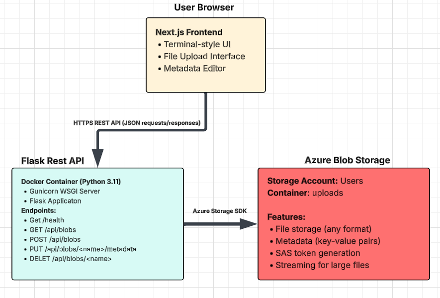

# Azure Blob Metadata Manager - Case Study

## 1) Executive Summary

**Problem:** Organizations and developers need an efficient way to manage files stored in cloud storage systems, particularly Azure Blob Storage. Traditional cloud storage interfaces are often complex and don't provide easy ways to view, organize, and manage file metadata. Users need a simple, web-based interface to upload files, view their contents, and edit metadata without navigating complex cloud portals. The company that we are working with whats the web-based interface to match the companies theme of 80s retro. 

**Solution:** Azure Blob Metadata Manager is a modern web application that provides a user-friendly terminal-style interface for managing Azure Blob Storage. The application allows users to upload files, view them directly in the browser, list all stored files with their metadata, and edit blob metadata through an intuitive retro style web interface. Built with Flask (Python) for the REST API and Next.js for the frontend, the application is fully containerized and **designed primarily for local development** using Docker with Azurite (Azure Storage emulator). The application can also be deployed to Azure cloud services for production use (see Deployment section).

## 2) System Overview

### Course Concept(s)

This project implements several key concepts from the course modules:

1. **Flask API Development**: The backend is built using Flask, demonstrating RESTful API design, request handling, CORS configuration, and proper error handling. The API provides endpoints for CRUD operations on Azure Blob Storage.

2. **Cloud Storage Integration**: The project integrates with Azurite (Azure Storage emulator) for local development, demonstrating cloud storage patterns, SAS token generation for secure access, and metadata management. The same codebase can work with real Azure Blob Storage when deployed to the cloud.

3. **Containerization**: The application is **fully containerized** using Docker - all services (backend API, frontend, and Azurite) run in containers, demonstrating container-based deployment, environment variable management, and reproducible builds. No host dependencies required beyond Docker.

### Architecture Diagram



The architecture consists of:
- **Frontend Layer**: Next.js application with React 19 and TypeScript, providing a retro usable user interface
- **API Layer**: Flask REST API running in a Docker container, handling all blob operations
- **Storage Layer**: 
  - **Local Development**: Azurite (Azure Storage emulator) running in Docker
  - **Production**: Azure Blob Storage (when deployed to cloud)

### Data/Models/Services

- **Azurite (Azure Storage Emulator)** - **Primary/Default**: Local Azure Storage emulator for development and testing
  - Container: `uploads` (default, configurable)
  - File formats: Any (images, PDFs, documents, etc.)
  - Metadata: Key-value pairs stored as blob properties
  - No Azure subscription required - runs entirely locally in Docker
  - Provides the same API as Azure Blob Storage for seamless local development
  - **This is the default and recommended setup for local development**

- **Azure Blob Storage** - **Optional/Production**: Real Azure cloud storage (see Deployment section)
  - Requires Azure subscription
  - Same API as Azurite, so code works without changes
  - Used only when deploying to production

- **No external datasets or models**: The application manages user-uploaded files only

## 3) Local Development

### Prerequisites

- **Docker** (required - all services(Flask, Node.js, Azurite) run in containers)
- Optional: Python 3.8+ and pip (only needed if running tests locally without Docker)

**Note**: This project is **fully containerized** and **designed primarily for local development** using Azurite (Azure Storage emulator), which requires no Azure subscription or cloud resources. All dependencies (Python, Node.js, etc.) are handled automatically by Docker. Cloud deployment instructions are provided in the Deployment section for users who want to deploy to production.

### Installing Dependencies

**All Dependencies:**
- Automatically handled by Docker during container builds (no manual installation needed)
- Python dependencies: Installed in the backend container
- Node.js dependencies: Installed in the frontend container

### Quick Start (Recommended)

The easiest way to run the application locally is using the `run.sh` script:

```bash
# Make the script executable (if needed)
chmod +x run.sh

# Run the application (starts Azurite, API, and frontend)
./run.sh
```

The script automatically:
- Starts Azurite (Azure Storage emulator) in a Docker container
- Builds and starts the Flask API container (configured to use Azurite)
- Builds and starts the Next.js frontend container
- Verifies all services are healthy

**All services run in Docker containers** - no need to install Node.js, Python, or any other dependencies on your host machine!


### Manual Setup

#### Backend API

```bash
# Build the Docker image
docker build -t blob-manager:latest -f web/Dockerfile ./web

# Run the container (using Azurite for local development)
# Make sure Azurite is running first (or use docker-compose)
docker run --rm -p 5001:5000 \
  -e AZURE_STORAGE_CONNECTION_STRING="DefaultEndpointsProtocol=http;AccountName=devstoreaccount1;AccountKey=Eby8vdM02xNOcqFlqUwJPLlmEtlCDXJ1OUzFT50uSRZ6IFsuFq2UVErCz4I6tq/K1SZFPTOtr/KBHBeksoGMGw==;BlobEndpoint=http://azurite:10000/devstoreaccount1;" \
  -e BLOB_CONTAINER="uploads" \
  blob-manager:latest
```

#### Frontend

```bash
# Build the frontend Docker image
docker build -t blob-frontend:latest \
  --build-arg NEXT_PUBLIC_API_URL=http://localhost:5001 \
  -f code/Dockerfile ./code

# Run the frontend container
docker run -d \
  --name blob-frontend \
  --network azurite-network \
  -p 3000:3000 \
  -e NEXT_PUBLIC_API_URL=http://localhost:5001 \
  blob-frontend:latest
```

Access the frontend at http://localhost:3000

### Using Docker Compose

Alternatively, use Docker Compose to run all services:

```bash
docker-compose up
```

### Health Checks

Verify services are running:

```bash
# API health
curl http://localhost:5001/health
# Expected: {"ok": true}

# Storage connectivity
curl http://localhost:5001/health/storage
# Expected: {"ok": true, "container": "uploads"}
```

### Testing the API

```bash
# List all blobs
curl http://localhost:5001/api/blobs

# Upload a test file
curl -X POST -F "file=@/path/to/your/file.pdf" http://localhost:5001/api/blobs

# Get blob metadata
curl http://localhost:5001/api/blobs/your-file-name.pdf
```

## 4) Production Cloud Deployment (Optional)

> **Important**: This project is **designed primarily for local development** using Azurite. The deployment instructions below are for advanced users who want to deploy to Azure cloud services for production use. For most users, local development with Azurite is sufficient and recommended.

### Overview

If you want to deploy the application to Azure cloud services (optional), it can be deployed using:
- **Frontend**: Azure Static Web Apps (Next.js static export)
- **Backend API**: Azure Container Apps (Flask API in Docker)
- **Storage**: Azure Blob Storage (replaces Azurite)

**Prerequisites for Deployment:**
- Azure subscription
- Azure CLI installed and configured
- Azure Container Registry (ACR)
- Azure Container Apps environment
- Azure Static Web Apps resource


### Deploy Backend API to Azure Container Apps

```bash
# Build Docker image
docker build -t blob-manager:latest -f web/Dockerfile ./web

# Tag and push to Azure Container Registry (ACR)
az acr build --registry <your-acr-name> --image blob-manager:latest ./web

# Deploy to Container Apps
az containerapp create \
  --name retro-azure-metadata-api \
  --resource-group <your-resource-group> \
  --image <your-acr-name>.azurecr.io/blob-manager:latest \
  --environment <container-app-env> \
  --env-vars \
    AZURE_STORAGE_CONNECTION_STRING=<connection-string> \
    BLOB_CONTAINER=uploads
```

#### Deploy Frontend to Azure Static Web Apps

```bash
cd code

# Build Next.js app (static export)
NEXT_PUBLIC_API_URL=<your-api-url> pnpm build

# Deploy using Azure Static Web Apps CLI
swa deploy ./out --app-name <your-static-web-app-name>
```

### Environment Configuration

For production deployment, configure these environment variables:

**Backend (Container Apps):**
- `AZURE_STORAGE_CONNECTION_STRING`: Azure Storage connection string (replaces Azurite)
- `BLOB_CONTAINER`: Blob container name (default: `uploads`)
- `SAS_EXPIRY_MINUTES`: SAS token expiry (default: 5 minutes)
- `ACCOUNT_KEY`: Storage account key (for SAS generation)

**Frontend:**
- `NEXT_PUBLIC_API_URL`: Public URL of the deployed API

### Post-Deployment Verification

1. Check API health: `curl https://<your-api-url>/health`
2. Check storage connectivity: `curl https://<your-api-url>/health/storage`
3. Verify frontend can connect to API
4. Test file upload and metadata operations

## 5) Testing

I have included a image in assets folder that you can use to test the upload. The project includes smoke tests in the `tests/` directory to verify basic API functionality. These tests are designed to work with Azurite (local Azure Storage emulator) and require no Azure subscription.


### Prerequisites

1. **Install test dependencies:**
   ```bash
   pip install -r tests/requirements.txt
   ```
   
   Or install manually:
   ```bash
   pip install pytest requests
   ```

2. **Ensure the API is running:**
   The tests require the Flask API to be running. You can start it using:
   ```bash
   # Using the run.sh script (recommended)
   ./run.sh
   ```

### Running Tests

Navigate to the `tests/` directory and run:

```bash
cd tests

# Run all tests
pytest test_smoke.py -v

# Run with API URL override (if API is on different port)
API_BASE_URL=http://localhost:5001 pytest test_smoke.py -v

# Run a specific test
pytest test_smoke.py::test_health_endpoint -v

```

### Test Coverage

The smoke tests verify:
- Health endpoint functionality (`/health`)
- Storage connectivity (`/health/storage`)
- List blobs endpoint (`/api/blobs`)
- File upload functionality (`POST /api/blobs`)
- Error handling for invalid requests
- CORS configuration

### Test Behavior

- **Automatic API Detection**: Tests automatically wait for the API to be ready (up to 30 seconds)
- **Test File Creation**: Test files are created automatically if needed
- **Cleanup**: Uploaded test files are cleaned up after tests complete
- **Skip on Failure**: Tests will skip if the API is not available (rather than failing)

### Example Output

```bash
$ cd tests && pytest test_smoke.py -v

test_smoke.py::test_health_endpoint PASSED
test_smoke.py::test_storage_health_endpoint PASSED
test_smoke.py::test_list_blobs_endpoint PASSED
test_smoke.py::test_api_info_endpoint PASSED
test_smoke.py::test_upload_endpoint PASSED
test_smoke.py::test_cors_headers PASSED
test_smoke.py::test_error_handling PASSED

========= 7 passed in 2.34s =========
```

### Troubleshooting

- **API not found**: Make sure the API is running on `http://localhost:5001` (or set `API_BASE_URL` environment variable)
- **Connection errors**: Verify Azurite is running and the API container is connected to the `azurite-network`
- **Import errors**: Ensure test dependencies are installed: `pip install -r tests/requirements.txt`

## 6) Design Decisions

### Why Flask?

Flask was chosen for the API layer because:
- **Simplicity**: Flask provides a lightweight, flexible framework that's easy to understand and maintain
- **Course Alignment**: Flask is a key concept covered in the course modules
- **Azure Integration**: Flask integrates seamlessly with Azure SDKs and services
- **Containerization**: Flask applications containerize easily and run efficiently in Docker

**Alternatives Considered:**
- **FastAPI**: More modern but adds complexity; Flask is sufficient for this use case.

### Why Azurite (Azure Storage Emulator)?

Azurite was chosen because:
- **Local Development**: No Azure subscription required, runs entirely locally
- **Azure Compatibility**: Provides the same API as Azure Blob Storage for seamless development
- **Metadata Support**: Native support for blob metadata (key-value pairs)
- **Docker Integration**: Easy to run in containers alongside the application
- **SAS Tokens**: Supports SAS token generation for secure access testing

**Alternatives Considered:**
- **Real Azure Blob Storage**: Requires subscription and cloud resources (not needed for local dev)
- **MongoDB**: Overkill for simple file storage needs and didnt want my images/files stored in this way. I wanted an infinite Blob :0. 

### Tradeoffs

**Performance:**
- **Pros**: Streaming file downloads for large files, efficient metadata queries, local storage (no network latency)
- **Cons**: Limited to local machine storage capacity

**Cost:**
- **Pros**: Completely free - no cloud costs, no subscription required
- **Cons**: Limited to local machine resources

**Complexity:**
- **Pros**: Simple architecture, easy to understand and maintain, no cloud setup required
- **Cons**: Data is stored locally and not persisted across machine restarts (unless using Docker volumes)

**Maintainability:**
- **Pros**: Well-structured code, clear separation of concerns
- **Cons**: Two separate applications (frontend/backend) require coordination

### Security/Privacy

**Secrets Management:**
- Environment variables used for configuration
- Azurite uses default development credentials (no real secrets needed for local development)
- Production deployment requires Azure Key Vault or secure environment variable management

**Input Validation:**
- File upload size limits enforced
- Filename sanitization to prevent path traversal
- Content-Type validation for file viewing

**PII Handling:**
- No user authentication (can be added for production)
- Files stored as-is; no automatic PII extraction
- Users responsible for metadata they add

**Network Security:**
- CORS configured to allow frontend connections
- Security headers (CSP, HSTS) implemented
- Local development runs on localhost (production uses HTTPS when deployed)

### Operations

**Logging:**
- Flask application logs to stdout (captured by container runtime)
- Error logging for failed operations
- Health check endpoints for monitoring

**Metrics:**
- Health endpoints (`/health`, `/health/storage`) for basic monitoring
- Container resource usage visible via Docker commands

**Known Limitations:**
- No user authentication (all users share the same storage)
- No file versioning or backup
- Metadata editing requires blob re-upload (Azure Storage API limitation)
- Local development only - data stored in Docker containers

## 7) Results & Evaluation

### Performance Notes

**API Response Times:**
- Health check: < 50ms
- List blobs: ~200-500ms (depends on number of files)
- File upload: Depends on file size (streaming for large files)
- Metadata update: ~100-200ms

**Resource Footprint:**
- Container: Minimal resources (default Docker limits)
- Storage: Limited to local disk space
- Network: Local only (no external network calls)

### Validation/Tests

**Smoke Tests:**
- Health endpoint returns 200 OK
- Storage health check verifies connectivity
- List blobs returns valid JSON
- Upload endpoint accepts files
- Metadata update persists correctly

Run tests:
```bash
cd tests
python -m pytest test_smoke.py -v
```

**Manual Testing:**
- Upload various file types (images, PDFs, documents). Can use the one provided in assets!
- Verify files appear in blob list
- Edit metadata and verify persistence
- View files in browser
- Delete blobs and verify removal

## 8) What's Next

### Planned Improvements

1. **User Authentication**: Add basic authentication for user-specific storage
2. **File Versioning**: Implement version history for uploaded files
3. **Search Functionality**: Full-text search across blob names and metadata
4. **Batch Operations**: Upload/delete multiple files at once

### Refactors

1. **API Testing**: Expand test coverage with unit and integration tests
2. **Error Handling**: More detailed error messages and recovery mechanisms

### Stretch Features

1. **File Sharing**: Generate shareable links with expiration (local network)
2. **Analytics Dashboard**: Usage statistics and storage analytics

## 9) Links & Resources

- **GitHub Repository**: https://github.com/JedDataScience/RetroAzureBlobMetadataStorage
- **My Public Cloud Version**:
  - Frontend: https://victorious-wave-0fd8b771e.3.azurestaticapps.net
  - API: https://retro-azure-metadata-api.wonderfulisland-bcb9cf0e.westus2.azurecontainerapps.io

## License

See [LICENSE](LICENSE) file for details.
